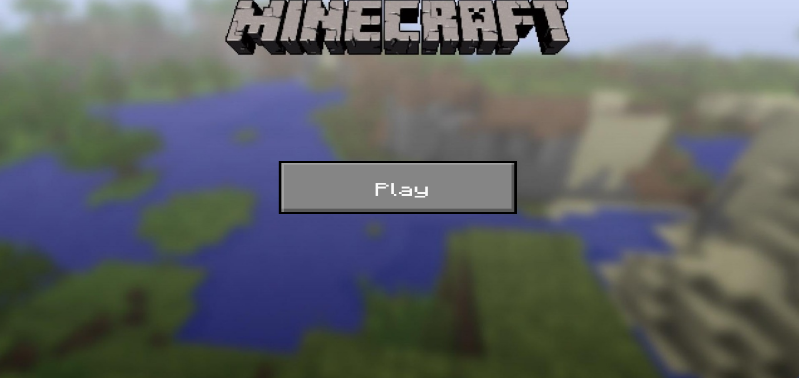
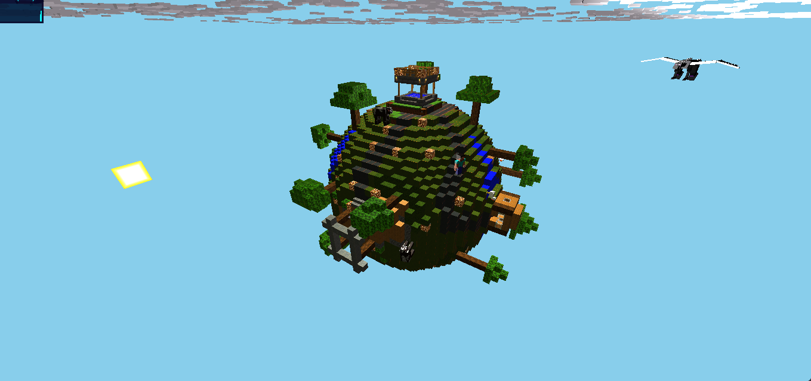

# minecraft-world
According to the ideas discussed during the development of the first deliverable, many proposals emerged, of which there were quite a few good ones; however, we opted for one which caught our attention after seeing several examples on the internet, which is a “Sky Blocks” style minecraft world. It is planned to develop a scene where the world will be made up of blocks and within it there will be characters, animals, clouds and trees as can be seen in the following image:

As you can see the world is a sphere, which in the same way is planned to be implemented in the final deliverable. Additionally, we plan to implement a day and night system within the scene and in terms of animations, we plan to animate the clouds so that they can move linearly around the world. The technologies to be used for the development of the project will be WebGL, Blender and Three.js. We were discussing other options such as Unity and Cinema4D, but we were very interested and excited to learn the tools mentioned above.

---

## Development

## Resources
During the development of the project we created our minecraft world model by playing minecraft (literally), afterwards we imported the map into blender to start working with textures, lights and animations. Finally we used Three.js and TypeScript to pass our blender model to a webpage, where everyone who access to it can see our final work.

The characters and mobs models were taken from
[Nils Söderman](https://nilssoderman.com/downloads/minecraft-blender-rig/) webpage, where he allows people to download his awesome works.

## Contributors
- Rey Vega - [@ReyVega](https://github.com/ReyVega)
- José Luis Águilar - [@JosxLuis](https://github.com/josxluis)

## Inspiration
[Minecraft World - Microsoft](https://news.microsoft.com/stories/block-by-block/)
